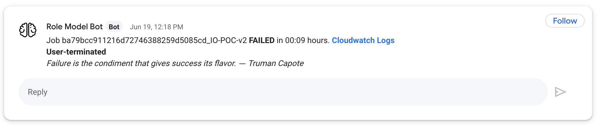
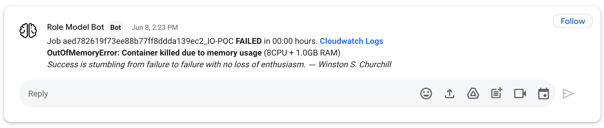

# flibbertigibbet
A chatty bot that sends failed AWS Batch jobs notifications and provides emotional support.

Flibbertigibbet is a lambda function that monitors AWS Batch jobs and sends notifications directly into Slack (or the 
chat software of your choice). It is triggered by a cloudwatch rule that monitors Batch Job state change events for a 
specific Batch queue. The lambda receives this event and parses  the JSON to build an appropriate message with all the 
relevant information, including a clickable link to the job's Cloudwatch Log to facilitate debugging. The message is 
then pushed to an endpoint of your choice (can be slack, google chat, any service that provides an API webhook will 
work). In case of job failure, a comforting quote is also appended to the message.

Examples of flibbertigibbet notifications in Google Chat:



Cloudwatch rule format below - under `JobQueue`, list all queue names the lambda should watch.

```json
{
  "source": [ "aws.batch"],
  "detail-type": ["Batch Job State Change"],
  "detail": {
  "jobQueue": [ 
    "arn:aws:batch:$(AWS_REGION):$(AWS_ACCOUNT_ID):job-queue/$(AWS_BATCH_QUEUE_NAME1)",
    "arn:aws:batch:$(AWS_REGION):$(AWS_ACCOUNT_ID):job-queue/$(AWS_BATCH_QUEUE_NAME2)"
],
  "status": ["FAILED", "SUCCEEDED"]
  }
}
```

Why Flibbertigibbet?
> noun: flibbertigibbet; a frivolous or excessively talkative person.
> Flibbertigibbet is one of many incarnations of the Middle English word flepergebet, meaning "gossip" or "chatterer." 
> It is a word of onomatopoeic origin, created from sounds that were intended to represent meaningless chatter. 
> Shakespeare apparently saw a devilish aspect to a gossipy chatterer; he used "flibbertigibbet" in King Lear as the 
> name of a devil.